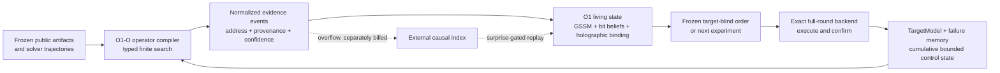

# Combined Architecture

This lab treats O1, O1-O and the full-round recovery work as complementary
subsystems. It is not a repository-claim audit. The engineering question is which
existing primitives can be composed into a stronger scientific machine.

## System boundary



The existing repositories remain immutable inputs. All new state, reports and
derived artifacts stay under this lab's `runs/` tree.

## What comes directly from O1-O

The local original contains a complete deterministic control cycle rather than a
single generator: reconnaissance, service-conditioned planning, the full tool
pipeline, deployment, result ingestion, retry, follow-up chaining and reporting.
The real session `O1-O/2026-02-18_013412` exercises that cycle with 16 generated
tasks, 4,271 lines, all 16 compile checks passing, 10 structural verifications,
six adaptive retries, three process recoveries and one generated follow-up.

The reusable primitives are:

- the finite Color/fragment operator space;
- deterministic route selection and chain validation;
- the living `TargetModel` of observations and attempts;
- failure-conditioned action suppression and retry mutation;
- result-to-next-action chaining;
- complete event artifacts that can be replayed offline.

This lab generalizes that cycle from offensive tool actions to scientific
cryptanalytic actions. A fragment becomes a legal analysis operator, a service
fact becomes a public/candidate/solver observation, a deployment result becomes a
measured experiment result, and a follow-up becomes the next target-blind probe.

## What comes directly from O1

O1 supplies four different memory roles, kept distinct here:

1. The recurrent living state carries the current experiment context.
2. Explicit bit-belief channels accumulate signed evidence for a fixed key width.
3. Holographic phase codes bind evidence to semantic addresses such as `bit/137`,
   `round/6/carry/12` or `constraint/904`.
4. A causal index can retain full historical evidence, but its growth is accounted
   separately and it is disabled in the first bounded-state benchmark.

The explicit 256-channel belief bank is useful even though it is not compressed:
it tests whether weak evidence can be integrated across an arbitrarily longer
stream. Holography is a separate capacity/addressability experiment.

## Two orthogonal type axes

O1-O's Colors answer the structural question: what data shape can connect to what
operator? Cryptanalytic evaluation adds an independent question: where did the
information come from?

The lab therefore carries both:

| Axis | Examples | Enforced property |
|---|---|---|
| Semantic kind | `PUBLIC_FIELD`, `CANDIDATE_TRACE`, `EVIDENCE_STATE`, `SCORE` | Operators connect compatible values |
| Information label | `PUBLIC`, `CONTROL`, `CANDIDATE_ASSUMPTION`, `INTERNAL_TRAIN` | Provenance can only accumulate |

`TARGET_SECRET`, `INTERNAL_TARGET` and `POST_REVEAL` can never be converted into
`TARGET_BLIND_ORDER`. An operator cannot remove labels, so no later conversion can
launder revealed information.

## Normalized event bridge

`EvidenceEvent` is the seam between systems. Each event contains:

- an immutable source artifact and SHA-256;
- an address for bit, round, carry, constraint, hypothesis or task;
- one of `OBSERVATION`, `HYPOTHESIS`, `SUPPORT`, `CONTRADICTION`, `ACTION`, `RESULT`;
- confidence and signed value;
- a provenance label set;
- a separated outcome dimension.

Outcome separation is deliberate:

```text
generation succeeded != process exited successfully
process exited successfully != capability was demonstrated
capability was demonstrated != research mission progressed
```

The O1-O replay adapter reads `session.json`, per-task `meta.json` and
`execution_result.json`, plus aggregate counts from `engagement_report.json`. It
never imports `generated.py`, never runs a stored tool, and does not stream unparsed
stdout/stderr into memory. Output must be a JSON string; raw bytes are omitted while
length and an unsalted content fingerprint remain for integrity, not secrecy. The
February session is therefore immediately useful as
a deterministic offline control trace without touching its original directory.
Because that schema did not retain retry-parent IDs, the adapter preserves aggregate
retry/recovery/chaining counts and explicitly declines to fabricate edges.

## Cumulative control state

`CryptanalyticTargetModel` persists the source snapshot, family attempt counts,
best validation gain, surprise, failure counts and structural blacklists. Its living
control state is explicitly capped: 64 family slots, 64 failure-code slots,
128-byte identifiers and unsigned 64-bit counters by default. Full failure records
remain in the separately billed append-only ledger. The adaptive planner ranks legal
proposals by expected information gain per billed work unit, with a
novelty/surprise bonus. Target-derived labels are rejected both during selection and
again during result ingestion.

Train/test isolation is a state machine, not only documentation. Discovery accepts
training and validation feedback, but only validation outcomes can update
`best_validation_gain` or the validation-staleness stop; freezing binds the exact
TEST proposal and plan SHA-256; the matching test can be consumed once; only then
can post-test audit open. Discovery failures and post-test diagnoses are appended to
different physical JSONL files, and a scope mismatch is rejected while reading.

Neutral historical replay events update observation counters without being treated
as gain, failure or staleness. Scientific result events use the normal success and
failure transitions. This is the O1-O feedback topology with a stopping rule: once repeated
steps are stale, automatic discovery stops instead of silently searching forever.
The state has a canonical SHA-256 so every decision can cite the exact prior model.

## First end-to-end chain

The default registry already composes the following complete path:

```text
PUBLIC_RELATIONS
  -> align_public_blocks
  -> build_control_corrected_field
  -> project_solver_trajectory
  -> o1_stream_accumulate
  -> calibrate_against_matched_null
  -> freeze_target_blind_order
  -> execute_frozen_order
  -> exact_cipher_confirm
```

The compiler also contains an explicit post-reveal ranking operator. Its purpose is
to prove the negative gate: the type system rejects it whenever it attempts to emit
a target-blind order.

## State and work accounting

Every retained result must report four different budgets:

- recurrent state cells and numeric precision;
- external-index entries and serialized bytes;
- total public relations and solver/cipher evaluations;
- operator-search work, including rejected chains and retries.

`O(1)` in this lab means constant in stream length unless the key-width or address-
space axis is named. A direct 256-register vault is therefore bounded in time but
linear in the declared key width.
